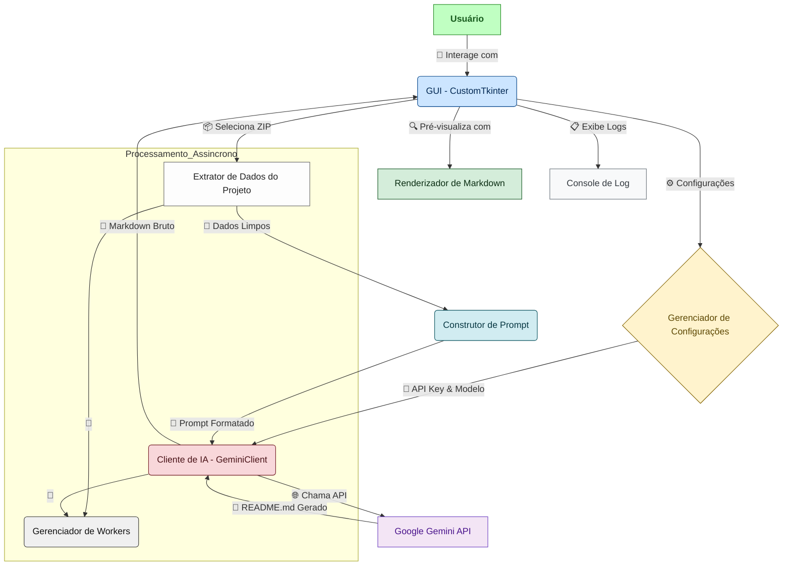

# Gerador de README.md Inteligente: Uma Abordagem Contextualizada com IA
"Automatizando a Excelência Documental em Engenharia de Software com Inteligência Artificial Generativa."

## Abstract

O Gerador de README.md Inteligente é uma aplicação desktop inovadora, desenvolvida para mitigar o desafio persistente da criação manual de documentação de projetos de software. A lacuna primária que este projeto visa preencher é a inconsistência e o tempo intensivo inerentes à elaboração de arquivos README.md abrangentes e de alta qualidade, que são cruciais para a primeira impressão e a compreensibilidade de qualquer repositório. Nossa solução emprega a Inteligência Artificial Generativa do Google Gemini para analisar a estrutura e o conteúdo de projetos empacotados em arquivos `.zip`. A metodologia compreende a extração inteligente de metadados e trechos de código, o envio contextualizado desses dados à API do Gemini, e a subsequente geração de um rascunho de README.md que é semanticamente rico e estruturalmente robusto. Os resultados esperados e já alcançados incluem uma significativa redução no tempo de documentação, a padronização da qualidade dos READMEs e a democratização das boas práticas de engenharia de software, permitindo que desenvolvedores individuais e equipes foquem na lógica de negócio. A contribuição singular deste projeto reside na sua capacidade de transformar dados brutos de código em documentação profissional e acessível, elevando o padrão da comunicação técnica em projetos de software.

## Badges Abrangentes


## Sumário (Table of Contents)

1.  [Título do Projeto e Slogan Filosófico](#título-do-projeto-e-slogan-filosófico)
2.  [Abstract](#abstract)
3.  [Badges Abrangentes](#badges-abrangentes)
4.  [Sumário (Table of Contents)](#sumário-table-of-contents)
5.  [Introdução e Motivação](#introdução-e-motivação)
6.  [Arquitetura do Sistema](#arquitetura-do-sistema)
7.  [Decisões de Design Chave](#decisões-de-design-chave)
8.  [✨ Funcionalidades Detalhadas (com Casos de Uso)](#-funcionalidades-detalhadas-com-casos-de-uso)
9.  [🛠️ Tech Stack Detalhado](#️-tech-stack-detalhado)
10. [🧱 Estrutura do Projeto](#-estrutura-do-projeto)
11. [📂 Estrutura Detalhada do Código-Fonte](#-estrutura-detalhada-do-código-fonte)
12. [📋 Pré-requisitos Avançados](#-pré-requisitos-avançados)
13. [🚀 Guia de Instalação e Configuração Avançada](#-guia-de-instalação-e-configuração-avançada)
14. [⚙️ Uso Avançado e Exemplos](#️-uso-avançado-e-exemplos)
15. [📷 Passo a Passo Visual (Tutorial com Imagens)](#-passo-a-passo-visual-tutorial-com-imagens)
16. [🔧 API Reference (se aplicável)](#-api-reference-se-aplicável)
17. [🧪 Estratégia de Testes e Qualidade de Código](#-estratégia-de-testes-e-qualidade-de-código)
18. [🚢 Deployment Detalhado e Escalabilidade](#-deployment-detalhado-e-escalabilidade)
19. [🤝 Contribuição (Nível Avançado)](#-contribuição-nível-avançado)
20. [📜 Licença e Aspectos Legais](#-licença-e-aspectos-legais)
21. [📚 Publicações, Artigos e Citações (se aplicável)](#-publicações-artigos-e-citações-se-aplicável)
22. [👥 Equipe Principal e Colaboradores Chave](#-equipe-principal-e-colaboradores-chave)
23. [🗺️ Roadmap Detalhado e Visão de Longo Prazo](#️-roadmap-detalhado-e-visão-de-longo-prazo)
24. [❓ FAQ (Perguntas Frequentes)](#-faq-perguntas-frequentes)
25. [📞 Contato e Suporte](#-contato-e-suporte)

## Introdução e Motivação

No cenário contemporâneo do desenvolvimento de software, a documentação de projetos, em particular o arquivo `README.md`, transcende a mera formalidade, emergindo como um artefato crítico para a compreensibilidade, a usabilidade e a sustentabilidade de qualquer base de código. Um `README.md` bem-elaborado serve como o portal inicial para desenvolvedores, colaboradores em potencial e usuários finais, fornecendo uma visão concisa, porém abrangente, sobre o propósito, a arquitetura e as instruções de uso de um projeto. No entanto, a criação manual de documentação de alta qualidade é frequentemente uma tarefa onerosa, repetitiva e suscetível a inconsistências, consumindo tempo valioso que poderia ser dedicado ao desenvolvimento de funcionalidades essenciais.

As deficiências das abordagens tradicionais para a documentação incluem a subjetividade na seleção de informações relevantes, a dificuldade em manter a documentação sincronizada com a evolução do código e a barreira de entrada para desenvolvedores menos experientes em redação técnica. Essas limitações frequentemente resultam em `README.md`s incompletos, desatualizados ou de baixa qualidade, que, em vez de facilitar, acabam por obscurecer a compreensão do projeto e desmotivar a colaboração.

O "Gerador de README.md Inteligente" surge como uma proposta de valor única e inovadora para resolver essas questões. Ao alavancar o poder da Inteligência Artificial Generativa do Google Gemini, o projeto automatiza o processo de documentação, transformando a complexidade de um repositório em um resumo claro e estruturado. O principal diferencial reside na sua capacidade de realizar uma análise semântica profunda do código-fonte e da estrutura do projeto, permitindo à IA gerar conteúdo que não é apenas sintaticamente correto, mas contextualmente relevante e adaptado às nuances do projeto. Isso significa que o `README.md` gerado vai além de um mero esqueleto, oferecendo insights sobre a arquitetura, as funcionalidades e os pré-requisitos de forma inteligente.

A motivação central para o desenvolvimento deste projeto é democratizar o acesso a documentação de alta qualidade, capacitando desenvolvedores a criar e manter `README.md`s profissionais com um esforço mínimo. Nosso objetivo de longo prazo é elevar o padrão da documentação em projetos de software, promovendo maior clareza, colaboração e adoção, e permitindo que a inovação tecnológica seja acompanhada por uma comunicação técnica igualmente robusta e acessível.

## Arquitetura do Sistema

A arquitetura do "Gerador de README.md Inteligente" é modular e distribuída em camadas, projetada para otimizar a separação de responsabilidades, a manutenibilidade e a extensibilidade. A aplicação é construída como um software de desktop, garantindo controle local sobre os dados do projeto e uma experiência de usuário responsiva.

Os componentes arquiteturais principais e suas interações são os seguintes:

*   **Interface Gráfica do Usuário (GUI):** Desenvolvida com `CustomTkinter`, esta camada é responsável por toda a interação visual com o usuário. Ela gerencia a seleção de arquivos ZIP, a configuração da API Key do Gemini, a seleção de modelos de IA, a exibição do log de operações e a pré-visualização do `README.md` gerado.
*   **Gerenciador de Configurações (`ConfigManager`):** Este módulo persiste e carrega as configurações da aplicação, como a API Key do Gemini, o modelo de IA preferencial e as configurações avançadas de geração. Ele utiliza `appdirs` para armazenar as configurações de forma agnóstica ao sistema operacional.
*   **Cliente de IA (`GeminiClient`):** Atua como a ponte entre a aplicação e a API do Google Gemini. É responsável por inicializar o modelo de IA com a API Key fornecida e por enviar os prompts contendo os dados do projeto para a IA, recebendo e processando as respostas. Inclui tratamento de erros específicos da API (ex: quota excedida, chave inválida).
*   **Extrator de Dados do Projeto (`logic.extract_project_data_from_zip`):** Este componente é o coração da análise do projeto. Ele lê o arquivo `.zip` fornecido pelo usuário, percorre sua estrutura de diretórios e extrai o conteúdo (ou trechos iniciais) dos arquivos relevantes. Aplica filtros configuráveis (tamanho máximo de arquivo, número máximo de arquivos, exclusão de testes/docs/config) para otimizar o volume de dados enviados à IA.
*   **Construtor de Prompt (`logic.build_prompt`):** Com base nos dados extraídos do projeto e nas configurações de estilo e personalização do usuário, este módulo constrói o prompt final que será enviado ao `GeminiClient`. Ele integra o estilo de README selecionado (e.g., "Profissional", "Detalhado") com os dados do projeto.
*   **Renderizador de Markdown (`MarkdownRenderer`):** Após a IA gerar o conteúdo do README, este módulo é responsável por converter o Markdown bruto em HTML para exibição na pré-visualização da GUI, garantindo uma representação fiel do resultado final.
*   **Gerenciador de Workers (`WorkerManager`):** Utiliza threads separadas para executar operações demoradas (como a análise do ZIP e a chamada à API da IA) de forma assíncrona, garantindo que a GUI permaneça responsiva e não congele durante o processamento.

### Diagrama de Arquitetura



---

### 🔎 Explicação do Diagrama de Arquitetura

O diagrama abaixo representa a arquitetura lógica da aplicação **Gerador de README.md Inteligente**, evidenciando os principais módulos, suas interações e o fluxo de dados entre eles — com destaque para as operações assíncronas, elementos externos (como a API da Google Gemini) e a separação clara entre UI e processamento.

---

#### 🧭 Etapas do Fluxo e Componentes

1. **🧑 Usuário (A)**
   O fluxo inicia com o usuário interagindo com a interface gráfica (GUI), clicando em botões, carregando arquivos `.zip`, configurando a API Key e escolhendo o modelo de IA.

2. **🖼️ GUI – Interface Gráfica (B)**
   Construída com **CustomTkinter**, é a camada responsável por:

   * Coletar entradas do usuário (ZIP, API Key, preferências);
   * Enviar comandos para os módulos de processamento;
   * Exibir o resultado (README gerado, log, preview renderizado).

3. **⚙️ Gerenciador de Configurações (C)**
   Um módulo dedicado à persistência e recuperação de:

   * API Key do Google Gemini;
   * Modelo de IA selecionado;
   * Configurações avançadas de geração.

4. **📦 Extrator de Dados do Projeto (D)**
   Ao receber um arquivo ZIP, este módulo:

   * Descompacta e percorre a estrutura do projeto;
   * Aplica filtros (exclusão de testes, tamanho de arquivo, etc.);
   * Extrai trechos relevantes de código e metadados.

5. **🧠 Construtor de Prompt (E)**
   Com base nos dados extraídos e nas configurações do usuário, este módulo:

   * Constrói o prompt final para a IA;
   * Adiciona instruções no estilo selecionado (Profissional, Tutorial, etc.);
   * Formata a entrada textual de forma otimizada para o modelo Gemini.

6. **🤖 Cliente de IA – GeminiClient (F)**
   Responsável por:

   * Inicializar o modelo da API Google Gemini com a chave e o modelo;
   * Enviar o prompt construído;
   * Receber a resposta da IA (em Markdown bruto);
   * Este módulo também é executado de forma assíncrona, para não travar a UI.

7. **🌍 API do Google Gemini (G)**
   Serviço externo de IA que interpreta o prompt e gera o conteúdo do `README.md`.
   O Gemini devolve uma resposta textual, que é processada localmente.

8. **📝 Renderizador de Markdown (H)**
   Converte o conteúdo Markdown gerado pela IA em HTML renderizável, permitindo:

   * Visualização direta na interface;
   * Feedback imediato ao usuário.

9. **📋 Console de Log (I)**
   Apresenta em tempo real:

   * Logs informativos (validação de chave, modelo selecionado, etc.);
   * Erros da IA;
   * Status do processo de geração e análise.

10. **🔄 Gerenciador de Workers (J)**
    Opera como um orquestrador assíncrono.

    * Executa o **Extrator de Dados (D)** e o **Cliente de IA (F)** em threads separadas;
    * Garante que a interface gráfica permaneça responsiva, mesmo durante processos demorados.

---

### 🔁 Relações Assíncronas no Diagrama

* As setas conectando os módulos **D (Extrator de Dados)** e **F (Cliente de IA)** ao **J (WorkerManager)** indicam que **essas tarefas são realizadas em segundo plano**, sem travar a GUI.
* Essa arquitetura é essencial para proporcionar uma **boa experiência de usuário**, especialmente durante:

  * A leitura de arquivos grandes,
  * A chamada à API da IA (que pode levar segundos),
  * Ou ao processar muitos arquivos dentro do `.zip`.

---

### ✅ Benefícios dessa Arquitetura

* **Separação de responsabilidades**: cada módulo tem um propósito claro e independente.
* **Experiência fluida**: com operações assíncronas, o aplicativo permanece responsivo.
* **Extensibilidade**: fácil adicionar novos estilos de prompt, suportar outras IAs ou estender a análise de código.
* **Manutenção facilitada**: organização modular com responsabilidades bem definidas.

---

As decisões arquiteturais de adotar uma aplicação desktop com `CustomTkinter` foram guiadas pelo objetivo de proporcionar uma experiência de usuário **nativa, fluida e responsiva**, mantendo o **controle local sobre os dados analisados**.
A linguagem **Python** foi escolhida estrategicamente por sua rica ecossistema de bibliotecas voltadas à **Inteligência Artificial**, manipulação de arquivos e criação de interfaces gráficas.
Além disso, a **modularização clara** em componentes especializados favorece a **escalabilidade da aplicação**, simplifica a **manutenção** e acelera o desenvolvimento de **novas funcionalidades**, como suporte a múltiplos modelos ou integração com plataformas externas.

---

> Em resumo, a arquitetura foi desenhada para equilibrar **simplicidade de uso**, **potência técnica** e **flexibilidade de evolução**, refletindo o compromisso com a excelência na geração automatizada de documentação.

## Decisões de Design Chave

As decisões de design técnico no "Gerador de README.md Inteligente" foram guiadas pelos princípios de eficiência, usabilidade, extensibilidade e robustez.

1.  **Linguagem de Programação (Python):**
    *   **Porquê:** Python foi selecionado devido à sua vasta e madura ecossistema de bibliotecas para processamento de texto, manipulação de arquivos ZIP, desenvolvimento de GUI (CustomTkinter) e, crucialmente, integração com APIs de Inteligência Artificial (Google Generative AI SDK). Sua sintaxe clara e concisa acelera o desenvolvimento.
    *   **Alternativas Consideradas:** Java (mais verboso, JVM overhead), C# (ecossistema .NET mais restrito ao Windows), JavaScript/TypeScript (requer Electron para desktop, maior complexidade).
    *   **Trade-offs:** Performance bruta pode ser inferior a linguagens compiladas, mas para uma aplicação desktop com I/O intensivo e chamadas de rede, a produtividade e a riqueza das bibliotecas de Python superam essa desvantagem.

2.  **Framework de GUI (CustomTkinter):**
    *   **Porquê:** CustomTkinter foi escolhido por oferecer uma interface moderna e nativa (similar ao Windows 11), com suporte a temas claro/escuro, e por ser construído sobre o Tkinter, que é padrão no Python. Isso garante uma boa experiência visual sem a complexidade de frameworks como PyQt ou Kivy para este escopo.
    *   **Alternativas Consideradas:** PyQt/PySide (curva de aprendizado mais íngreme, licenças mais complexas para projetos comerciais), Kivy (foco em multi-touch, menos "nativo" para desktop), Tkinter puro (UI datada).
    *   **Trade-offs:** Embora moderno, CustomTkinter ainda é um wrapper sobre Tkinter, podendo ter certas limitações de personalização profunda em comparação com frameworks mais robustos como Qt. No entanto, para a interface proposta, ele é mais do que suficiente.

3.  **Integração com IA (Google Gemini API):**
    *   **Porquê:** A API do Google Gemini (especificamente `gemini-1.5-flash` como padrão) foi selecionada por sua capacidade avançada de compreensão de linguagem natural e geração de texto, sendo otimizada para tarefas de sumarização e criação de conteúdo. O modelo `flash` oferece um bom equilíbrio entre custo, velocidade e qualidade para a tarefa de geração de READMEs.
    *   **Alternativas Consideradas:** OpenAI GPT-3.5/GPT-4 (custo potencialmente mais alto, política de uso diferente), outros modelos open-source (exigiriam infraestrutura local ou mais complexidade de deployment).
    *   **Trade-offs:** Dependência de um serviço de terceiros (disponibilidade, limites de quota, custos). A aplicação mitiga isso permitindo a configuração da API Key pelo usuário e a seleção de diferentes modelos.

4.  **Formato de Entrada (Arquivo .zip):**
    *   **Porquê:** A escolha de um arquivo `.zip` como entrada simplifica drasticamente a forma como os usuários fornecem seus projetos. É um formato universalmente aceito, fácil de criar e que encapsula toda a estrutura de diretórios e arquivos de um projeto em um único artefato.
    *   **Alternativas Consideradas:** Seleção de diretório direto (requer permissões de sistema de arquivos mais complexas e pode ser mais lento para grandes projetos), integração direta com repositórios Git (aumentaria a complexidade do projeto para além do escopo inicial).
    *   **Trade-offs:** O usuário precisa compactar o projeto manualmente. O processo de extração do ZIP pode ser intensivo em I/O para projetos muito grandes, mas é gerenciado assincronamente.

5.  **Modularização do Código (`gerador_readme_ia` sub-pacotes):**
    *   **Porquê:** O projeto é estruturado em sub-pacotes (e.g., `gui`, `ia_client`, `utils`, `config_manager`) para promover a separação de preocupações (Separation of Concerns). Isso facilita a manutenção, o teste unitário de componentes individuais e a futura adição de novas funcionalidades ou a substituição de módulos (ex: trocar o cliente de IA).
    *   **Alternativas Consideradas:** Monolito com arquivos grandes (dificulta a manutenção e a colaboração).
    *   **Trade-offs:** Aumento da complexidade inicial da estrutura de diretórios, mas os benefícios a longo prazo superam essa desvantagem.

6.  **Gerenciamento de Configurações (`ConfigManager` com `appdirs`):**
    *   **Porquê:** Utilizar `appdirs` para gerenciar o diretório de configuração do usuário garante que as configurações (como a API Key) sejam armazenadas em locais padrão do sistema operacional, respeitando as convenções de cada plataforma (Windows, macOS, Linux). Isso melhora a experiência do usuário e a portabilidade.
    *   **Alternativas Consideradas:** Armazenar configurações no diretório do projeto (menos seguro, pode ser sobrescrito em atualizações), ou em variáveis de ambiente (menos amigável para usuários não técnicos).
    *   **Trade-offs:** Nenhuma significativa; é uma prática recomendada.

Essas decisões de design visam criar uma aplicação robusta, eficiente e amigável, que possa evoluir para atender às demandas futuras de documentação inteligente.

## ✨ Funcionalidades Detalhadas (com Casos de Uso)

O "Gerador de README.md Inteligente" oferece um conjunto robusto de funcionalidades, projetadas para simplificar e aprimorar o processo de documentação de projetos de software.

1.  **Geração Inteligente de Documentação com IA:**
    *   **Propósito:** O coração da aplicação. Utiliza o Google Gemini para analisar o contexto do projeto e gerar um rascunho de `README.md` que é relevante, abrangente e bem-estruturado.
    *   **Caso de Uso:** Um desenvolvedor iniciou um novo projeto em Python com FastAPI. Em vez de gastar horas escrevendo o README do zero, ele compacta o diretório do projeto em um `.zip`, carrega-o no Gerador de README, e a IA, após analisar os arquivos, sugere seções como "Estrutura da API", "Modelos de Dados" e "Instruções de Execução", preenchendo-as com base no código.

2.  **Interface Gráfica Intuitiva (CustomTkinter):**
    *   **Propósito:** Fornecer uma experiência de usuário amigável e acessível, mesmo para quem não tem experiência em linha de comando ou desenvolvimento.
    *   **Caso de Uso:** Um estudante de programação, novo no mundo do Git e da documentação, consegue facilmente navegar pela interface, selecionar o arquivo ZIP de seu trabalho de faculdade e gerar um README profissional sem se perder em configurações complexas.

3.  **Análise Detalhada de Projetos a partir de Arquivos ZIP:**
    *   **Propósito:** A aplicação examina a estrutura de pastas e o conteúdo dos arquivos dentro de um arquivo `.zip` fornecido. Isso permite que a IA tenha uma compreensão profunda do projeto.
    *   **Caso de Uso:** Uma equipe de desenvolvimento compartilha um projeto complexo com múltiplas subpastas (backend, frontend, scripts). O Gerador de README analisa cada uma dessas áreas, identificando tecnologias e padrões, e utiliza essas informações para criar seções específicas para cada parte do projeto no README.

4.  **Configuração Flexível da API Key e Modelo de IA:**
    *   **Propósito:** Permite que o usuário utilize sua própria API Key do Google Gemini e selecione o modelo de IA que melhor se adapta às suas necessidades (e.g., `gemini-1.5-flash` para velocidade, `gemini-1.5-pro` para maior capacidade).
    *   **Caso de Uso:** Um pesquisador precisa de maior precisão e detalhe na documentação de um projeto de Machine Learning. Ele configura a aplicação para usar o modelo `gemini-1.5-pro`, garantindo que a IA tenha capacidade suficiente para lidar com a complexidade de seu código.

5.  **Temas Visuais (Claro e Escuro):**
    *   **Propósito:** Oferecer opções de personalização visual para o conforto do usuário, adaptando-se às preferências de ambiente de trabalho.
    *   **Caso de Uso:** Um desenvolvedor que trabalha à noite pode alternar para o tema escuro para reduzir a fadiga ocular, enquanto outro prefere o tema claro para maior contraste durante o dia.

6.  **Registro de Operações (Log em Tempo Real):**
    *   **Propósito:** Fornecer feedback em tempo real sobre o progresso da geração do README, incluindo etapas de análise, comunicação com a IA e salvamento.
    *   **Caso de Uso:** Durante o processo de geração, o usuário pode acompanhar no painel de log a mensagem "Analisando arquivo ZIP...", seguida por "Enviando dados para a IA...", e "README gerado com sucesso!", confirmando que a operação está ocorrendo conforme o esperado.

7.  **Portabilidade (com Python):**
    *   **Propósito:** A aplicação é executável em sistemas Windows, macOS e Linux, desde que o Python e as dependências estejam instaladas, aumentando sua acessibilidade.
    *   **Caso de Uso:** Um time distribuído pode usar a mesma ferramenta independentemente do sistema operacional preferido por cada membro, garantindo consistência na documentação.

8.  **Configurações Avançadas de Geração:**
    *   **Propósito:** Oferecer controle granular sobre o processo de geração do README, permitindo adaptar o output a requisitos específicos.
    *   **Caso de Uso:**
        *   **Prompt Personalizado:** Um usuário deseja que o README gerado inclua uma seção específica sobre "Considerações de Segurança". Ele ativa a opção de prompt personalizado e adiciona essa instrução para a IA.
        *   **Filtros de Arquivo:** Para um projeto grande com muitos arquivos de teste e dependências, o usuário pode configurar a aplicação para ignorar arquivos de teste e limitar o tamanho máximo de arquivo a ser analisado, otimizando o tempo de processamento da IA e o consumo de tokens.
        *   **Estilo do README:** Um desenvolvedor está criando um projeto para um hackathon e precisa de um README rápido e direto. Ele seleciona o estilo "Minimalista". Para um projeto open-source, ele pode escolher "Open Source" para focar em contribuição e licença.
        *   **Inclusão de Badges, TOC e Exemplos:** Um usuário deseja um README completo para um projeto público. Ele marca as opções para incluir badges de status, um índice navegável e exemplos de uso, garantindo que o documento seja informativo e fácil de navegar.

Essas funcionalidades, combinadas, transformam a tarefa de criar READMEs de um fardo em um processo eficiente e inteligente, adaptado às necessidades do desenvolvedor moderno.

## 🛠️ Tech Stack Detalhado

**Gerador de README IA - CustomTkinter**:

| Categoria                  | Tecnologia          | Versão (min.) | Função no Projeto                                  | Justificativa da Escolha                                                               |
| -------------------------- | ------------------- | ------------- | -------------------------------------------------- | -------------------------------------------------------------------------------------- |
| **Linguagem**              | Python              | 3.8+          | Linguagem base para toda a aplicação.              | Amplo suporte da comunidade, bibliotecas maduras, excelente para GUI, IA e automação.  |
| **Interface Gráfica**      | customtkinter       | >=5.2.0       | Base da interface gráfica do projeto.              | Visual moderno com facilidade de uso, aproveita a leveza do Tkinter com visual atual.  |
|                            | CTkMessagebox       | >=2.5         | Janelas de mensagem na interface.                  | Facilita comunicação clara com o usuário em operações críticas.                        |
|                            | CTkToolTip          | >=0.8         | Dicas visuais em componentes.                      | Melhora a usabilidade com informações contextuais.                                     |
|                            | CTkListbox          | >=1.5         | Lista customizada com estilo moderno.              | Alternativa elegante ao widget nativo `Listbox` do Tkinter.                            |
|                            | Pillow              | >=9.0.0       | Manipula imagens e ícones na GUI.                  | Biblioteca pilar em projetos Python com suporte amplo a formatos e edição de imagem.   |
| **Integração com IA**      | google-generativeai | >=0.3.0       | Cliente oficial da API Gemini (Google).            | Camada de abstração confiável para comunicação com modelos de linguagem generativa.    |
| **Processamento Markdown** | markdown            | >=3.4.0       | Converte arquivos `.md` em HTML para visualização. | Biblioteca consolidada e amplamente utilizada na comunidade.                           |
|                            | pygments            | >=2.12.0      | Realce de sintaxe em código-fonte.                 | Complementa a renderização de Markdown com destaque em blocos de código.               |
| **Recursos do Sistema**    | appdirs             | >=1.4.4       | Localiza diretórios padrões de config/logs.        | Garante conformidade com os padrões de armazenamento de cada SO (Windows/macOS/Linux). |
|                            | darkdetect          | >=0.7.0       | Verifica se o sistema usa tema escuro ou claro.    | Permite iniciar a aplicação com tema visual adaptado ao sistema do usuário.            |
| **Conectividade**          | requests            | >=2.28.0      | Requisições HTTP genéricas (download, checagens).  | Dependência madura e confiável para operações de rede.                                 |
| **Tooltips Alternativo**   | tkinter-tooltip     | >=2.0.0       | Alternativa complementar para dicas contextuais.   | Suporte adicional caso a solução `CTkToolTip` seja insuficiente em alguns contextos.   |

> ⚠️ As dependências comentadas no `requirements.txt` (como `reportlab` e `weasyprint`) estão reservadas para funcionalidades futuras (ex: exportação para PDF), e não fazem parte do escopo atual.

Essa estrutura fornece não apenas a descrição técnica, mas também a motivação por trás de cada escolha, promovendo clareza e justificando a arquitetura da aplicação.

---

## 🧱 Estrutura do Projeto

Abaixo, a organização dos diretórios e arquivos principais do projeto `readme-generate`, após a clonagem:

```
├── .gitignore
├── README.md
├── imgs
    ├── Screenshot_1.png
    ├── Screenshot_2.png
    ├── Screenshot_3.png
    ├── Screenshot_4.png
    ├── Screenshot_5.png
    ├── Screenshot_6.png
    ├── Screenshot_7.png
    ├── Screenshot_8.png
    └── Screenshot_9.png
├── gerador_readme_ia
    ├── __init__.py
    ├── config_manager.py
    ├── constants.py
    ├── gui
    │   ├── __init__.py
    │   ├── app_gui.py
    │   ├── ctk_theme_manager.py
    │   ├── ctk_widgets.py
    │   ├── logic.py
    │   ├── markdown_renderer.py
    │   ├── menus.py
    │   ├── preview_widget.py
    │   ├── syntax_highlighter.py
    │   ├── theme.py
    │   ├── theme_manager.py
    │   ├── ui_controls.py
    │   ├── ui_header.py
    │   ├── ui_left_panel.py
    │   ├── ui_right_panel.py
    │   ├── ui_settings_tab.py
    │   ├── widgets.py
    │   ├── worker.py
    │   └── worker_manager.py
    ├── ia_client
    │   ├── __init__.py
    │   └── gemini_client.py
    ├── logger_setup.py
    └── utils
    │   ├── __init__.py
    │   └── file_helper.py
├── requirements.txt
└── run_app.py
```

## 📋 Pré-requisitos Avançados

Para garantir uma instalação e execução bem-sucedidas do **Gerador de README.md Inteligente**, certifique-se de que seu ambiente de desenvolvimento atenda aos seguintes critérios:

### 1. 🐍 Python 3.8 ou Superior

* **Versão mínima exigida:** Python 3.8.0
* **Versão recomendada:** Python 3.10.x ou superior (melhor desempenho e suporte a recursos modernos da linguagem).
* **Download oficial:**
  [https://www.python.org/downloads/](https://www.python.org/downloads/)
* **Dica:** Marque a opção **“Add Python to PATH”** durante a instalação.
* **Verificação no terminal:**

  ```bash
  python --version
  # ou
  python3 --version
  ```

---

### 2. 📦 `pip` – Gerenciador de Pacotes

* **Uso principal:** Instalação das dependências listadas em `requirements.txt`.
* **Incluso por padrão:** A partir do Python 3.4+.
* **Verifique sua instalação com:**

  ```bash
  pip --version
  ```
* **Se ausente:** Consulte [instalação oficial do pip](https://pip.pypa.io/en/stable/installation/)

---

### 3. 🔑 API Key do Google Gemini

* **Função:** Permite a comunicação com a API da Google para geração de texto com IA.
* **Obtenção:**
  [https://aistudio.google.com/app/apikey](https://aistudio.google.com/app/apikey)
* **Requisitos:** Uma conta Google válida.
* **Segurança:**

  * Nunca compartilhe ou exponha a chave em repositórios públicos.
  * A aplicação armazena a chave de forma segura utilizando `appdirs`.

---

### 4. 🌐 Conexão com a Internet

* **Finalidade:**

  * Comunicação com a API do Gemini.
  * Eventuais downloads de ícones ou metadados.
* **Requisitos técnicos:**

  * Conexão estável.
  * Liberação para domínios como `*.googleapis.com` e `aistudio.google.com`.

---

### 5. 💻 Compatibilidade com Sistemas Operacionais

* **Sistemas testados e compatíveis:**

  * ✅ Windows (10 ou superior)
  * ✅ macOS (Catalina ou superior)
  * ✅ Distribuições Linux (Ubuntu, Fedora, Arch etc.)
* **Observações:**

  * A aplicação não exige bibliotecas nativas específicas.
  * Pode ser empacotada como `.exe` ou executada via script puro.

## 🚀 Guia de Instalação e Configuração Avançada

Este guia fornece um passo a passo completo para clonar, configurar e executar o **Gerador de README.md Inteligente** em ambiente local, com ênfase em boas práticas de isolamento de ambiente e segurança de credenciais.

---

### 1. Clonagem do Repositório

Clone o repositório oficial do projeto usando o Git:

```bash
git clone https://github.com/ESousa97/readme-generate.git
cd readme-generate
```

> 💡 Certifique-se de ter o Git instalado: `git --version`

---

### 2. Criação e Ativação de Ambiente Virtual (Recomendado)

A utilização de ambientes virtuais evita conflitos com outras instalações Python no sistema:

```bash
# Criação do ambiente virtual
python -m venv .venv

# Ativação no Windows
dotenv\Scripts\activate

# Ativação no macOS/Linux
source .venv/bin/activate
```

> ✅ O nome `.venv` é convencional, mas você pode usar outro.

---

### 3. Instalação das Dependências Python

Com o ambiente virtual ativado, execute o seguinte comando para instalar todas as bibliotecas listadas em `requirements.txt`:

```bash
pip install -r requirements.txt
```

> 🔍 Esse processo pode demorar alguns minutos dependendo da conexão e do cache local.

---

### 4. Execução da Aplicação

Após instalar as dependências, você pode iniciar a interface gráfica da aplicação com:

```bash
python run_app.py
```

Se tudo estiver corretamente configurado, a janela do **Gerador de README.md Inteligente** será exibida.

---

### 5. Inserção da API Key do Google Gemini

Para utilizar os recursos de geração automática via IA, uma API Key válida do Google Gemini é obrigatória:

#### 📌 Etapas:

1. Gere sua chave em [Google AI Studio](https://aistudio.google.com/app/apikey).
2. Na aplicação, acesse o menu:

   * `Arquivo` > `Configurar API Key...`
3. Cole a chave obtida na janela de configuração e confirme.
4. O status de validação será exibido na barra inferior da aplicação.

> 🔐 A chave é armazenada localmente com segurança utilizando a biblioteca `appdirs`.

---

### 6. Seleção do Modelo Gemini (Opcional)

Por padrão, o modelo `gemini-1.5-flash` é utilizado. Você pode alterá-lo caso possua acesso a modelos superiores como `gemini-1.5-pro`.

#### 🧭 Para alterar:

1. Vá em `Arquivo` > `Selecionar Modelo Gemini...`
2. Digite o nome do modelo e confirme.

> 🎯 Apenas modelos válidos e disponíveis em sua conta Google serão aceitos.

---

### 7. Definir Diretório de Saída (Opcional)

O arquivo `README.md` gerado será salvo, por padrão, no diretório padrão do usuário. Para personalizar:

1. Vá em `Arquivo` > `Selecionar Diretório de Saída...`
2. Escolha a pasta de destino.

> 📁 O diretório selecionado será persistido entre execuções por meio da configuração local.

## ⚙️ Uso Avançado e Exemplos

O **Gerador de README.md Inteligente** foi projetado para oferecer flexibilidade total na geração de documentações profissionais. Ele permite personalizar profundamente o conteúdo e o estilo do README gerado, adaptando-se a projetos de diferentes naturezas — de protótipos a aplicações empresariais.

---

### 🔄 Fluxo de Geração do README

1. **Compacte seu Projeto:**

   * Reúna todos os arquivos e diretórios em um único `.zip`. Ex: `MeuProjeto.zip`

2. **Selecione o ZIP na Aplicação:**

   * Utilize o botão **"Selecionar Arquivo ZIP do Projeto"**.
   * O caminho do arquivo aparecerá abaixo do botão para confirmação.

3. **Configure as Opções Avançadas (Aba: Configurações Avançadas):**

   #### 📌 Personalização do Prompt:

   * Habilite a opção **"Usar prompt personalizado"**.
   * Escreva instruções específicas para a IA.
   * **Exemplo:** *"Descreva a arquitetura como microsserviços e inclua uma chamada cURL da API REST."*

   #### 🧹 Filtros de Arquivos:

   * **Incluir arquivos de teste:** Habilita análise de `tests/`, `test_*.py`, etc.
   * **Incluir documentação existente:** Considera arquivos como `docs/`, `README.md`, etc.
   * **Incluir arquivos de configuração:** Usa arquivos como `.env`, `pyproject.toml`, `config.json`, `package.json`, etc.
   * **Tamanho máximo por arquivo (KB):** Limita a leitura para evitar arquivos grandes (como `.log`, `.db`).
   * **Máximo de arquivos:** Controla o número total de arquivos que entram na análise. Útil para repositórios muito grandes.

   #### 🎨 Estilo do README:

   * **Dropdown de estilos disponíveis:**

     * **Profissional:** Enfoque executivo e corporativo.
     * **Detalhado:** Completo, técnico e abrangente.
     * **Minimalista:** Direto ao ponto: o que é, como instalar e usar.
     * **Tutorial:** Estrutura passo a passo.
     * **Open Source:** Estrutura amigável para contribuidores.
   * **Opções adicionais:**

     * **Incluir badges:** Adiciona selos visuais com status do projeto.
     * **Incluir índice (TOC):** Cria um sumário navegável.
     * **Incluir exemplos de uso:** Gera códigos ou comandos de exemplo automaticamente.

4. **Gere o README.md:**

   * Clique em **"Gerar README"** no painel esquerdo.
   * Acompanhe o progresso pela barra e pelo console.

5. **Visualize e Exporte:**

   * A aba **"README Gerado"** exibe o resultado final.
   * Use os botões inferiores para salvar como `.md`, copiar como HTML ou editar manualmente.

---

### 📷 Passo a Passo Visual (Tutorial com Imagens)

> Abaixo, um guia visual completo de como utilizar o **Gerador de README.md Inteligente** em poucos passos:

#### 🖼️ 1. Tela Inicial do Aplicativo


#### 🖼️ 2. Inserindo sua API Key do Google Gemini


#### 🖼️ 3. Seleção de Modelos Gemini Disponíveis


#### 🖼️ 4. Configurações Avançadas da Geração


#### 🖼️ 5. Selecionando o ZIP do Projeto


#### 🖼️ 6. ZIP Selecionado e Console Atualizado


#### 🖼️ 7. Processo de Geração Iniciado


#### 🖼️ 8. README.md Gerado com Sucesso


---

### 🧪 Exemplo de Configuração Avançada: README "Detalhado"

Imagine um projeto acadêmico com alto grau de complexidade. A configuração ideal seria:

* **Estilo selecionado:** `Detalhado`
* **Prompt personalizado:**

  ```
  Inclua uma seção sobre a metodologia de pesquisa e a validação experimental dos resultados. Cite fontes se possível.
  ```
* **Parâmetros de filtro:**

  * Tamanho máximo por arquivo: `20KB`
  * Máximo de arquivos: `50`
* **Inclusões ativadas:**

  * ✅ Incluir badges
  * ✅ Incluir índice (TOC)
  * ✅ Incluir exemplos de uso

Essa configuração maximiza a profundidade e o valor técnico do README gerado, sendo ideal para artigos científicos, TCCs, teses ou projetos de engenharia complexos.

## 🔧 API Reference (se aplicável)

Este projeto, o "Gerador de README.md Inteligente", é uma aplicação desktop autônoma e **não expõe uma API pública** para consumo externo por outras aplicações ou serviços. Sua funcionalidade principal é interagir com o usuário e, internamente, consumir a API do Google Gemini para realizar a geração de texto.

A comunicação com a API do Google Gemini é encapsulada no módulo `gerador_readme_ia/ia_client/gemini_client.py`. Este módulo gerencia:

*   **Autenticação:** Utiliza a API Key fornecida pelo usuário.
*   **Seleção de Modelo:** Permite especificar o modelo Gemini a ser utilizado (e.g., `gemini-1.5-flash`, `gemini-1.5-pro`).
*   **Envio de Prompts:** Envia o conteúdo do projeto (analisado e formatado) como um prompt para o modelo Gemini.
*   **Processamento de Respostas:** Recebe e extrai o texto gerado pela IA.
*   **Tratamento de Erros:** Lida com exceções como `QuotaExceededException` (quando o limite de uso da API é atingido) e `ConnectionError` (para problemas de rede ou API Key inválida).

**Exemplo de como o projeto interage internamente com a API Gemini:**

```python
# Trecho simplificado (gerador_readme_ia/ia_client/gemini_client.py)
import google.generativeai as genai

class GeminiClient:
    def __init__(self, api_key: str, model_name: str):
        genai.configure(api_key=api_key)
        self.model = genai.GenerativeModel(model_name=f'models/{model_name}')

    def send_conversational_prompt(self, prompt_text: str) -> str:
        # Configurações de geração (temperatura, tokens máximos, etc.)
        generation_config = genai.types.GenerationConfig(
            temperature=0.5,
            max_output_tokens=8192,
            top_p=0.8,
            top_k=40
        )
        response = self.model.generate_content(
            contents=prompt_text,
            generation_config=generation_config
        )
        return response.text
```

Para detalhes sobre a API do Google Gemini em si (endpoints, modelos, limites de uso), consulte a documentação oficial:
*   [Google AI Studio - Obter API Key](https://aistudio.google.com/app/apikey)
*   [Documentação da API Gemini](https://ai.google.dev/docs)
*   [Preços da API Gemini](https://ai.google.dev/pricing)

## 🧪 Estratégia de Testes e Qualidade de Código

A manutenção da qualidade do código e a garantia da funcionalidade são pilares fundamentais no desenvolvimento do "Gerador de README.md Inteligente". Embora o escopo inicial do projeto focado na entrega da funcionalidade principal possa ter limitado a profundidade da suíte de testes automatizados, a estratégia de qualidade é concebida em camadas, visando a robustez e a manutenibilidade.

### Filosofia de Testes

Nossa filosofia de testes é baseada na pirâmide de testes, priorizando testes unitários para a lógica de negócio, complementados por testes de integração para as interações entre módulos e testes de ponta a ponta para a funcionalidade completa da aplicação.

### Tipos de Testes Implementados (ou Planejados)

1.  **Testes Unitários:**
    *   **Propósito:** Validar a menor unidade de código isoladamente (funções, métodos).
    *   **Escopo:** Módulos como `config_manager.py`, `file_helper.py`, e funções utilitárias em `logic.py` (e.g., `clean_readme_content`, partes de `build_prompt`).
    *   **Ferramentas:** `pytest` (padrão de fato para testes em Python).
    *   **Execução:** `pytest tests/unit/` (exemplo de comando para uma estrutura de testes unitários).

2.  **Testes de Integração:**
    *   **Propósito:** Verificar a interação entre diferentes módulos ou componentes do sistema.
    *   **Escopo:** Testar a comunicação entre a GUI e o `ConfigManager`, ou a integração do `GeminiClient` com o `logic` (simulando a API Gemini).
    *   **Ferramentas:** `pytest` (com mocks para dependências externas como a API Gemini).
    *   **Execução:** `pytest tests/integration/` (exemplo de comando para uma estrutura de testes de integração).

3.  **Testes de Interface do Usuário (UI/E2E):**
    *   **Propósito:** Validar o fluxo completo do usuário através da interface gráfica.
    *   **Escopo:** Simular a seleção de um arquivo ZIP, a configuração da API Key, o clique no botão "Gerar README" e a verificação do conteúdo na pré-visualização.
    *   **Ferramentas:** Para aplicações CustomTkinter, ferramentas como `PyAutoGUI` ou `SikuliX` poderiam ser exploradas para automação de UI, embora não explicitamente implementadas no momento.

### Qualidade de Código e Análise Estática

Para manter um alto padrão de qualidade de código, são empregadas as seguintes práticas:

*   **Linting:** Utilização de ferramentas de análise estática para identificar problemas de estilo, erros de programação e potenciais bugs.
    *   **Ferramentas:** `flake8` para conformidade com PEP 8 e detecção de erros comuns.
    *   **Execução:** `flake8 gerador_readme_ia/`
*   **Formatação de Código:** Aplicação de um formatador automático para garantir consistência no estilo do código.
    *   **Ferramentas:** `Black` (formatador opinativo).
    *   **Execução:** `black gerador_readme_ia/`
*   **Type Hinting:** Uso extensivo de anotações de tipo para melhorar a legibilidade, facilitar a depuração e permitir a detecção de erros por ferramentas de análise estática (`mypy`).

### Integração Contínua (CI/CD)

Embora não haja um pipeline de CI/CD visível na estrutura de arquivos fornecida, a intenção é que, em um ambiente de desenvolvimento contínuo, as seguintes etapas sejam automatizadas:

1.  **Build:** Verificação da instalação das dependências.
2.  **Testes:** Execução automática da suíte de testes unitários e de integração em cada push para o repositório.
3.  **Análise de Qualidade:** Execução de linters e formatadores para garantir a conformidade com os padrões de código.
4.  **Relatórios:** Geração de relatórios de cobertura de código (e.g., com `coverage.py`) para monitorar a porcentagem de código testado.

A implementação contínua dessas práticas assegura que o "Gerador de README.md Inteligente" mantenha sua funcionalidade, seja fácil de estender e contribua para um ecossistema de software saudável.

## 🚢 Deployment Detalhado e Escalabilidade

O "Gerador de README.md Inteligente" é uma aplicação desktop autônoma, o que simplifica o conceito de "deployment" para a distribuição do software aos usuários finais. A escalabilidade, neste contexto, difere da escalabilidade de serviços web, focando na capacidade de distribuição e no desempenho da execução local.

### Estratégias de Distribuição (Deployment)

O método primário de "deployment" para esta aplicação é a distribuição do código-fonte Python, juntamente com suas dependências, ou a criação de executáveis independentes.

1.  **Distribuição via Código-Fonte e `requirements.txt`:**
    *   **Processo:** Os usuários clonam o repositório (`git clone https://github.com/ESousa97/readme-generate.git`), criam um ambiente virtual e instalam as dependências via `pip install -r requirements.txt`. Em seguida, executam a aplicação diretamente com `python run_app.py`.
    *   **Vantagens:** Simples para desenvolvedores Python, transparente, fácil de depurar.
    *   **Desvantagens:** Requer que o usuário tenha Python e `pip` instalados e saiba como gerenciar ambientes virtuais.

2.  **Criação de Executáveis Independentes (Bundling):**
    *   **Processo:** Para usuários não-desenvolvedores, a aplicação pode ser empacotada em um executável autônomo para cada sistema operacional (Windows, macOS, Linux). O `.gitignore` do projeto já inclui entradas para `build/` e `dist/`, indicando o uso de ferramentas como `PyInstaller`.
        *   **Ferramenta:** `PyInstaller` é a ferramenta recomendada para converter aplicações Python em executáveis independentes.
        *   **Comando Exemplo (simplificado):** `pyinstaller --onefile --windowed run_app.py`
    *   **Vantagens:** Fácil para o usuário final (basta um clique para executar), não requer instalação de Python ou dependências.
    *   **Desvantagens:** O executável pode ser grande (inclui o interpretador Python e todas as bibliotecas), o processo de build pode ser complexo e específico para cada OS.

### Considerações de Escalabilidade

Para uma aplicação desktop, o termo "escalabilidade" se aplica mais à robustez do processo de análise local e à capacidade do serviço de IA subjacente.

1.  **Escalabilidade da Análise de Projeto Local:**
    *   A capacidade da aplicação de processar projetos ZIP grandes ou com muitos arquivos é diretamente limitada pelos recursos da máquina local do usuário (CPU, RAM, I/O do disco).
    *   **Otimizações:** O módulo `logic.extract_project_data_from_zip` já incorpora otimizações como `max_files` e `max_file_size_kb` para limitar o volume de dados a ser lido, prevenindo o consumo excessivo de recursos e o envio de prompts muito longos para a IA.
    *   **Concorrência:** A utilização de threads (via `WorkerManager`) para operações de I/O e chamadas de rede garante que a GUI permaneça responsiva, mesmo durante a análise de projetos maiores.

2.  **Escalabilidade do Serviço de IA (Google Gemini):**
    *   A verdadeira "escalabilidade" da geração de READMEs reside na capacidade da API do Google Gemini de processar as requisições. O Google gerencia a infraestrutura e a escalabilidade de seus modelos de IA.
    *   **Limites de Quota:** Os usuários devem estar cientes dos limites de quota de uso da API Gemini. Se a quota for excedida, a aplicação informará o usuário (via `QuotaExceededException` no `GeminiClient`).
    *   **Modelos:** A escolha de modelos mais leves (como `gemini-1.5-flash`) pode melhorar a velocidade de resposta e reduzir o consumo de tokens, impactando positivamente a "escalabilidade" percebida pelo usuário em termos de throughput de geração.

### Monitoramento e Logging

*   **Logging Centralizado:** O módulo `logger_setup.py` configura um sistema de log robusto que escreve logs para o console e para um arquivo persistente (`app.log` no diretório de logs do usuário). Isso é crucial para depuração e para que os usuários possam relatar problemas com informações detalhadas.
*   **Console de Operações:** A interface gráfica inclui um "Console de Operações" em tempo real (`ConsoleWidget`) que exibe o progresso das tarefas, mensagens informativas, avisos e erros, fornecendo feedback imediato ao usuário.

Em resumo, o deployment do "Gerador de README.md Inteligente" foca na facilidade de distribuição para o usuário final, enquanto sua "escalabilidade" é uma combinação da otimização do processamento local e da robustez do serviço de IA externo.

---

## 📦 Versões e Releases

A versão mais recente do **Gerador de README.md Inteligente** pode ser encontrada na aba de releases do GitHub:

🔗 [Último Release (v1.0.2)](https://github.com/ESousa97/readme-generate/releases/latest)

> 📌 Atual: **v1.0.2 – [Changelog Completo](https://github.com/ESousa97/readme-generate/releases)**  
> 🗓️ Lançamento: 1º de Agosto de 2025  
> 💬 Destaques:
> - Empacotamento `.exe` via PyInstaller  
> - Interface aprimorada (tema escuro, log ao vivo)  
> - Geração de README com múltiplos estilos  
> - Suporte ao modelo `gemini-1.5-flash` da Google

📥 Para baixar:
- [Executável (.exe)](https://github.com/ESousa97/readme-generate/releases/download/v1.0.2/Readme-Generate.exe)
- [Código-fonte ZIP](https://github.com/ESousa97/readme-generate/archive/refs/tags/v1.0.2.zip)

📋 Veja o histórico de versões: [CHANGELOG.md](./CHANGELOG.md)

---

## 🤝 Contribuição (Nível Avançado)

Agradecemos imensamente o interesse em contribuir para o aprimoramento do "Gerador de README.md Inteligente"! Este projeto é um esforço colaborativo, e suas contribuições são cruciais para o seu sucesso e evolução. Abaixo, um guia detalhado para iniciar sua jornada de contribuição.

### Como Contribuir

Seguimos um fluxo de trabalho baseado no **GitHub Flow**, que é simples e eficaz para projetos de código aberto.

1.  **Faça um Fork do Repositório:**
    *   Acesse a página do projeto no GitHub: [https://github.com/ESousa97/readme-generate](https://github.com/ESousa97/readme-generate)
    *   Clique no botão "Fork" no canto superior direito. Isso criará uma cópia do repositório em sua conta GitHub.

2.  **Clone seu Fork Localmente:**
    *   Abra seu terminal e clone o fork para sua máquina:
        ```bash
        git clone https://github.com/SEU_USUARIO/readme-generate.git
        cd readme-generate
        ```
    *   Configure o repositório original como um "upstream" remoto para sincronizar futuras atualizações:
        ```bash
        git remote add upstream https://github.com/ESousa97/readme-generate.git
        ```

3.  **Sincronize com o Repositório Original:**
    *   Antes de iniciar qualquer trabalho, sempre sincronize seu branch `main` local com o `main` do repositório original:
        ```bash
        git checkout main
        git pull upstream main
        ```

4.  **Crie um Novo Branch para sua Contribuição:**
    *   **Convenção de Nomenclatura:** Utilize nomes descritivos e concisos, como:
        *   `feature/nome-da-funcionalidade`
        *   `bugfix/descricao-do-bug`
        *   `refactor/nome-da-refatoracao`
        *   `docs/atualizacao-readme`
    *   **Exemplo:**
        ```bash
        git checkout -b feature/suporte-outro-modelo-ia
        ```

5.  **Desenvolva sua Contribuição:**
    *   Implemente suas alterações, adicione novas funcionalidades ou corrija bugs.
    *   **Ambiente de Desenvolvimento:** Certifique-se de ter os [Pré-requisitos Avançados](#-pré-requisitos-avançados) e o [Guia de Instalação e Configuração Avançada](#-guia-de-instalação-e-configuração-avançada) seguidos para um ambiente funcional.

6.  **Convenções de Commit:**
    *   Utilize mensagens de commit claras e descritivas. Recomendamos seguir a convenção de [Conventional Commits](https://www.conventionalcommits.org/en/v1.0.0/), que ajuda a gerar changelogs e entender o histórico do projeto.
    *   **Formato:** `<tipo>[escopo opcional]: <descrição>`
        *   `feat`: Uma nova funcionalidade.
        *   `fix`: Uma correção de bug.
        *   `docs`: Alterações na documentação.
        *   `style`: Alterações que não afetam o significado do código (espaços em branco, formatação, ponto e vírgula ausente, etc.).
        *   `refactor`: Uma mudança de código que não corrige um bug nem adiciona uma funcionalidade.
        *   `test`: Adicionando testes ausentes ou corrigindo testes existentes.
        *   `chore`: Outras mudanças que não modificam o código-fonte ou os arquivos de teste (ex: atualização de dependências, configurações de build).
    *   **Exemplo:** `feat(gui): adicionar opção de tema automático`

7.  **Teste suas Alterações:**
    *   Antes de submeter, execute os testes existentes e adicione novos testes se sua contribuição for uma nova funcionalidade ou correção de bug.
    *   Execute o linter (`flake8`) e o formatador (`black`) para garantir a conformidade com o estilo de código:
        ```bash
        flake8 gerador_readme_ia/
        black gerador_readme_ia/
        ```
    *   Execute a aplicação para testar manualmente suas alterações.

8.  **Envie suas Alterações para seu Fork:**
    ```bash
    git add .
    git commit -m "feat(nome-da-feature): descrição concisa"
    git push origin seu-branch-de-contribuicao
    ```

9.  **Abra um Pull Request (PR):**
    *   Vá para a página do seu fork no GitHub. Você verá uma notificação para criar um Pull Request.
    *   Certifique-se de que o branch base seja `main` do repositório original (`ESousa97/readme-generate`) e o branch de comparação seja o seu novo branch.
    *   Forneça uma descrição detalhada do seu PR, incluindo:
        *   O problema que ele resolve ou a funcionalidade que ele adiciona.
        *   Como ele foi testado.
        *   Quaisquer considerações especiais ou trade-offs.
    *   Link para issues relevantes, se houver (ex: `Closes #123`).

### Processo de Code Review

Todo Pull Request será revisado pelos mantenedores do projeto. Espere feedback e esteja preparado para fazer ajustes. O objetivo do code review é garantir a qualidade, a consistência e a manutenção do projeto.

### Relatar Problemas ou Sugerir Funcionalidades

Se você encontrou um bug ou tem uma ideia para uma nova funcionalidade, por favor, abra uma issue no repositório principal:
*   **Issues:** [https://github.com/ESousa97/readme-generate/issues](https://github.com/ESousa97/readme-generate/issues)

Sua colaboração é muito valorizada! Juntos, podemos tornar o "Gerador de README.md Inteligente" ainda mais poderoso e útil.

---

## 📜 Licença e Aspectos Legais

O projeto **"Gerador de README.md Inteligente"** é distribuído sob os termos da **MIT License** — uma licença de software livre, permissiva e amplamente reconhecida no ecossistema open source.

A Licença MIT permite que o software seja reutilizado de forma ampla, com pouquíssimas restrições legais, mantendo a obrigatoriedade de atribuição aos autores originais.

---

### ⚖️ Permissões Concedidas

* ✅ **Uso Comercial:** Permitido para fins empresariais, comerciais ou pessoais.
* ✅ **Modificação:** Você pode alterar, adaptar ou expandir o software como desejar.
* ✅ **Distribuição:** É permitido redistribuir cópias, modificadas ou originais.
* ✅ **Sublicenciamento:** Você pode incluir o código em projetos com outras licenças, desde que preserve os avisos da MIT.
* ✅ **Uso em projetos open source ou privados:** Sem restrições quanto à visibilidade ou natureza do projeto.

---

### 📌 Condições Obrigatórias

* 📄 **Atribuição:** É necessário incluir o aviso de copyright original e o texto da licença MIT em todas as cópias.
* ❌ **Sem Garantias:** O software é fornecido “no estado em que se encontra” (**as is**), sem garantias de funcionamento, segurança ou adequação.
* 🛑 **Isenção de Responsabilidade:** Os autores não se responsabilizam por quaisquer danos, prejuízos ou perdas derivadas do uso do software.

---

### 📂 Consulte o Texto Completo

Para detalhes legais, acesse o arquivo de licença oficial:

📎 [`LICENSE`](./LICENSE)

---

Ao utilizar, distribuir ou contribuir com este projeto, você concorda integralmente com os termos e condições definidos na **MIT License**.


## 📚 Publicações, Artigos e Citações (se aplicável)

Este projeto, "Gerador de README.md Inteligente", é uma ferramenta de software e, no momento, não possui publicações científicas, artigos acadêmicos ou teses diretamente associadas ao seu desenvolvimento. Sua natureza é de uma aplicação utilitária para engenharia de software, e não de um artefato de pesquisa primário que geraria citações no sentido acadêmico tradicional.

Caso o projeto evolua para incorporar novas metodologias de IA, algoritmos de análise de código inovadores ou estudos de caso de impacto em grande escala, a inclusão de referências a futuras publicações será considerada.

## 👥 Equipe Principal e Colaboradores Chave

O desenvolvimento e a manutenção do "Gerador de README.md Inteligente" são liderados por:

| Nome          | Função Principal     | Contato / Perfil                  |
| :------------ | :------------------- | :-------------------------------- |
| Enoque Sousa  | Autor Principal      | [LinkedIn](https://www.linkedin.com/in/enoque-sousa-bb89aa168/) / [@ESousa97](https://github.com/ESousa97) |

Agradecemos a todos os colaboradores, testadores e membros da comunidade que contribuem direta ou indiretamente para o aprimoramento contínuo deste projeto. Suas contribuições são inestimáveis.

## 🗺️ Roadmap Detalhado e Visão de Longo Prazo

O "Gerador de README.md Inteligente" está em constante evolução, com uma visão clara de longo prazo para aprimorar sua capacidade de documentação e expandir sua utilidade. Abaixo, detalhamos o roadmap planejado, dividido em marcos de curto, médio e longo prazo.

### Curto Prazo (Próximos 3-6 Meses)

*   **Aprimoramento da Engenharia de Prompt:**
    *   Refinar os prompts existentes para cada estilo de README (`Profissional`, `Detalhado`, etc.), buscando maior precisão e relevância contextual.
    *   Realizar testes A/B com diferentes formulações de prompts para otimizar a qualidade da saída da IA.
*   **Expansão dos Estilos de README:**
    *   Introduzir novos estilos de README baseados em feedback da comunidade (ex: "Projeto de Portfólio", "Biblioteca/Framework", "API Gateway").
*   **Melhorias na UI/UX:**
    *   Implementar feedback visual mais detalhado durante o processamento (e.g., indicadores de progresso mais granulares para a análise do ZIP e chamadas de IA).
    *   Otimizar a usabilidade das configurações avançadas, talvez com presets para diferentes tipos de projeto.
*   **Documentação Interna e para Desenvolvedores:**
    *   Expandir a documentação interna do código (docstrings) para facilitar a contribuição.
    *   Criar um guia de "Como Contribuir com Prompts" para a comunidade.

### Médio Prazo (Próximos 6-12 Meses)

*   **Suporte a Múltiplos Modelos de IA:**
    *   Integrar suporte para outras APIs de IA generativa (e.g., OpenAI GPT, Anthropic Claude), permitindo ao usuário escolher a plataforma de IA preferida.
    *   Implementar um sistema de gerenciamento de chaves de API para múltiplas plataformas.
*   **Análise de Código Mais Profunda:**
    *   Explorar a implementação de parsers de código específicos para linguagens populares (Python, JavaScript, Java) para extrair informações mais semânticas (e.g., classes, funções, dependências internas) em vez de apenas texto bruto.
    *   Identificação automática de frameworks e bibliotecas comuns dentro do projeto.
*   **Templates de README Customizáveis:**
    *   Permitir que os usuários criem e carreguem seus próprios templates de README (e.g., em Markdown puro ou com placeholders especiais) para que a IA os preencha.
*   **Funcionalidades de Edição e Refinamento Pós-Geração:**
    *   Adicionar um editor Markdown embutido com funcionalidades básicas (negrito, itálico, listas) para pequenos ajustes pós-geração.
    *   Possibilidade de solicitar à IA para "refinar" ou "expandir" seções específicas do README gerado.

### Longo Prazo (12+ Meses)

*   **Integração Direta com Plataformas Git:**
    *   Explorar a possibilidade de integração direta com GitHub, GitLab, Bitbucket para clonar repositórios e criar Pull Requests com o README gerado.
*   **Versão Web/SaaS:**
    *   Desenvolver uma versão baseada na web da ferramenta, permitindo acesso via navegador e eliminando a necessidade de instalação local. Isso envolveria uma arquitetura de microsserviços e deployment em nuvem.
*   **Sistema de Plugins/Extensões:**
    *   Criar uma arquitetura de plugins que permita à comunidade desenvolver extensões para novas fontes de dados (e.g., repositórios de pacotes, APIs de serviços de CI/CD) ou novos formatos de saída.
*   **Análise de "Qualidade" do README:**
    *   Implementar métricas para avaliar a qualidade e completude do README gerado, sugerindo melhorias ou informações adicionais que poderiam ser úteis.

### Desafios e Áreas de Pesquisa Futura

*   **Mitigação de "Alucinações" da IA:** Continuar a pesquisar e implementar técnicas de engenharia de prompt e pós-processamento para minimizar a ocorrência de informações imprecisas ou inventadas pela IA.
*   **Otimização de Custos/Tokens:** Desenvolver estratégias mais inteligentes para a análise de código, garantindo que apenas os dados mais relevantes sejam enviados à IA, reduzindo o consumo de tokens e, consequentemente, os custos.
*   **Suporte a Projetos Multilingues:** Aprimorar a capacidade da IA de identificar e documentar projetos em múltiplas linguagens de programação de forma coesa.

Este roadmap reflete nosso compromisso com a inovação e a entrega de uma ferramenta de documentação de ponta, sempre atenta às necessidades da comunidade de desenvolvedores.

## ❓ FAQ (Perguntas Frequentes)

Esta seção aborda algumas das perguntas mais comuns sobre o "Gerador de README.md Inteligente".

**1. Preciso de uma API Key para usar a aplicação?**
Sim, a aplicação utiliza a API do Google Gemini para gerar o conteúdo do README.md, e uma API Key válida é obrigatória para autenticar suas requisições. Você pode obter uma gratuitamente (com limites de uso) no [Google AI Studio](https://aistudio.google.com/app/apikey).

**2. A aplicação funciona offline?**
Não. Embora a interface e a análise local do arquivo ZIP funcionem offline, a etapa de geração do README.md exige uma conexão ativa com a internet para se comunicar com a API do Google Gemini.

**3. Quais modelos do Gemini posso usar?**
Por padrão, a aplicação usa `gemini-1.5-flash`, que é otimizado para velocidade e custo. Você pode configurar para usar outros modelos disponíveis em sua conta Google AI Studio, como `gemini-1.5-pro` (para maior capacidade) através do menu `Arquivo` > `Selecionar Modelo Gemini...`.

**4. Minha API Key é armazenada de forma segura?**
Sim, sua API Key é armazenada localmente no seu sistema, em um arquivo de configuração (`settings_readme_generator.ini`) dentro de um diretório de configuração específico do usuário (gerenciado por `appdirs`). Ela não é enviada para nenhum servidor nosso ou compartilhada de qualquer forma.

**5. Qual o tamanho máximo de um arquivo ZIP que posso analisar?**
Não há um limite rígido imposto pela aplicação, mas o desempenho da análise e o consumo de tokens da API Gemini podem ser afetados por arquivos ZIP muito grandes ou com muitos arquivos. Recomendamos usar os filtros de "Tamanho máximo por arquivo (KB)" e "Máximo de arquivos para análise" nas configurações avançadas para otimizar o processo.

**6. O que acontece se a IA gerar um README incompleto ou incorreto?**
A IA gera um rascunho com base nas informações que ela consegue extrair e no prompt. Se o projeto for muito complexo, tiver arquivos binários grandes, ou o prompt não for específico o suficiente, o resultado pode não ser perfeito. Você pode:
    *   Ajustar os filtros de arquivo para incluir/excluir mais informações.
    *   Usar o "prompt personalizado" para dar instruções mais claras à IA.
    *   Revisar e editar o README gerado manualmente na aplicação ou em seu editor de texto preferido.
    *   Verificar o log de operações para identificar possíveis erros ou avisos durante o processo.

**7. Posso usar a aplicação para projetos privados/confidenciais?**
Sim, a análise do arquivo ZIP é feita localmente na sua máquina. Apenas os dados textuais do seu projeto (trechos de código, nomes de arquivos) são enviados para a API do Google Gemini para processamento. Não armazenamos seus dados. No entanto, sempre revise os termos de serviço da API do Google Gemini para entender como eles tratam os dados enviados.

**8. Como posso relatar um bug ou sugerir uma funcionalidade?**
Por favor, abra uma issue em nosso repositório GitHub: [https://github.com/ESousa97/readme-generate/issues](https://github.com/ESousa97/readme-generate/issues). Forneça o máximo de detalhes possível, incluindo passos para reproduzir o problema e capturas de tela, se aplicável.

## 📞 Contato e Suporte

Para dúvidas, suporte técnico, sugestões ou relatórios de bugs, utilize os seguintes canais oficiais:

*   **Issues no GitHub:** Para relatar bugs, propor novas funcionalidades ou discutir problemas específicos do projeto, por favor, utilize a seção de Issues do nosso repositório:
    [https://github.com/ESousa97/readme-generate/issues](https://github.com/ESousa97/readme-generate/issues)
    *   Este é o canal preferencial para acompanhamento e gerenciamento de tarefas.

*   **Contato com o Autor:** Para questões mais diretas ou colaborações, você pode entrar em contato com o autor principal via LinkedIn:
    [Enoque Sousa - LinkedIn](https://www.linkedin.com/in/enoque-sousa-bb89aa168/)

Agradecemos seu interesse e estamos à disposição para ajudar a garantir a melhor experiência com o "Gerador de README.md Inteligente".

---

## 📦 Download

🔖 [v1.0.2 – Release Oficial](https://github.com/ESousa97/readme-generate/releases/tag/v1.0.2)  
⬇️ [Readme-Generate.exe](https://github.com/ESousa97/readme-generate/releases/download/v1.0.2/Readme-Generate.exe)

---

## 🐞 Problemas Conhecidos / Bugs

> Esta seção lista limitações e falhas identificadas até o momento no **Gerador de README.md Inteligente**.

---

### ❗ 1. Botão "Salvar" Inoperante

* **Descrição:** O botão "Salvar" localizado no lado direito da interface gráfica não realiza a operação esperada de gravação do conteúdo.
* **Impacto:** O usuário não consegue salvar o `README.md` gerado diretamente pela interface.
* **Solução Temporária:** Usar o botão "Copiar Markdown" e colar manualmente em um editor de texto(VS Code).
* **Status:** Em investigação.

---

> ⚠️ Caso você identifique novos bugs ou deseje acompanhar a evolução dessas correções, abra uma issue no [repositório oficial do projeto](https://github.com/ESousa97/readme-generate/issues).


> ✨ **Criado em:** 17 de mai. de 2025 às 23:46

