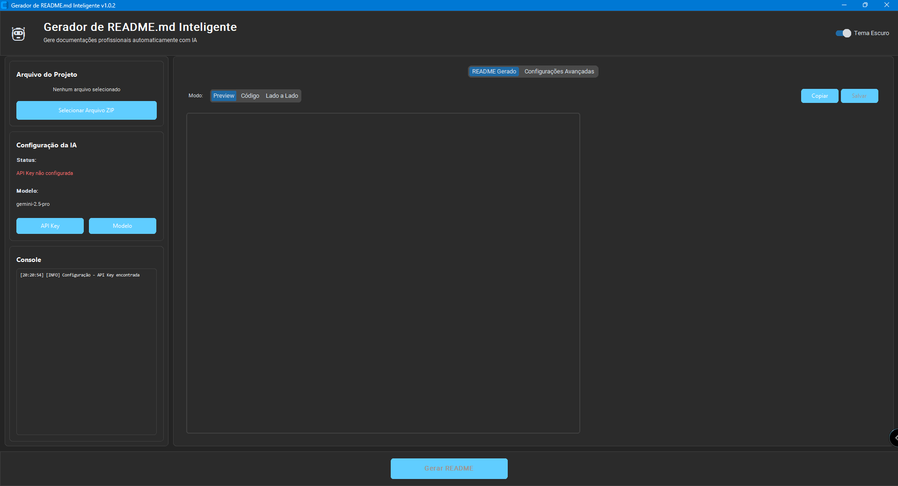
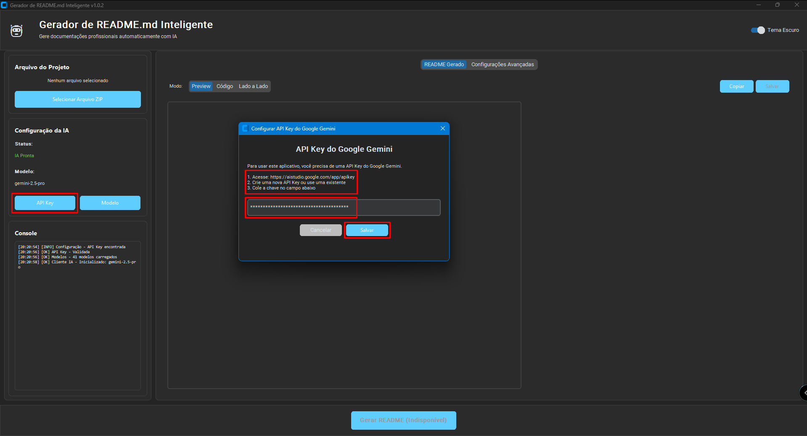
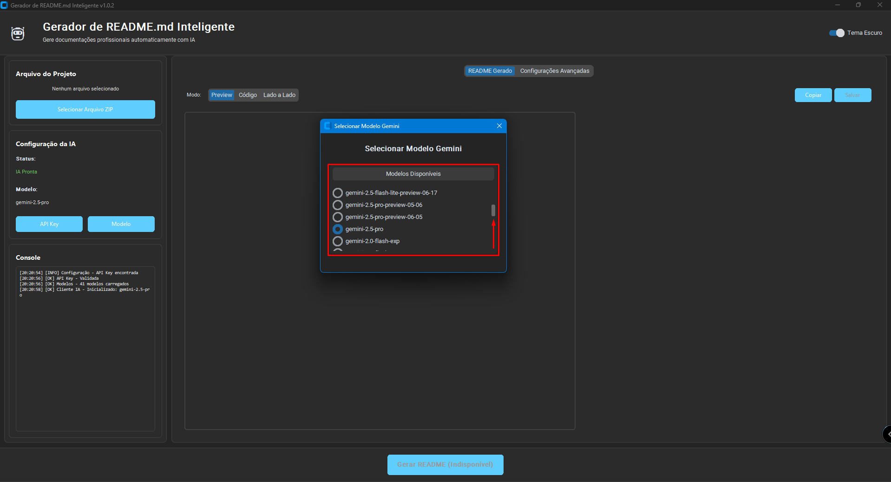
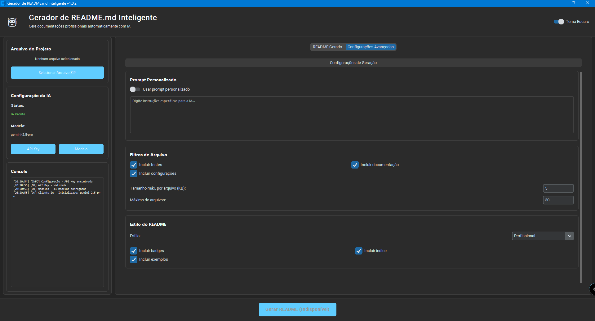
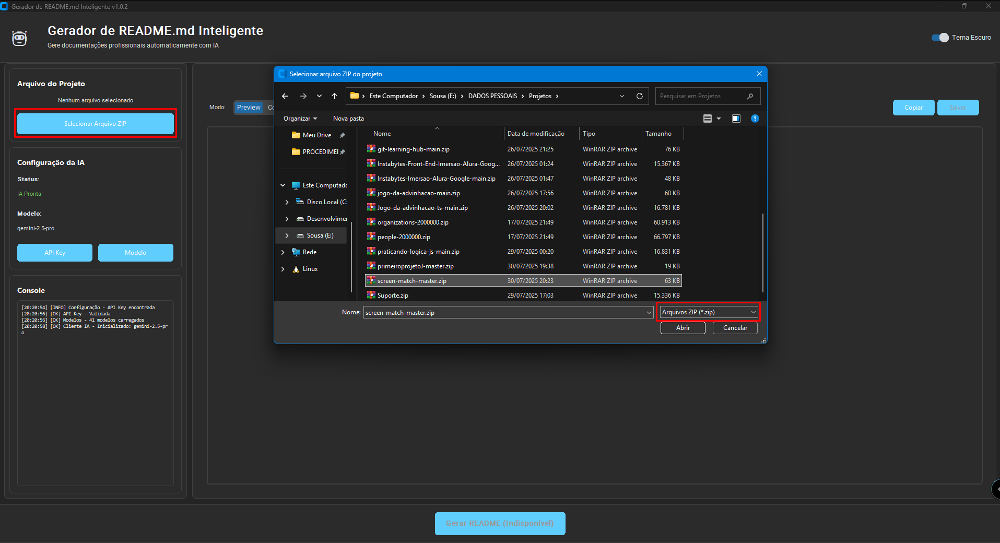
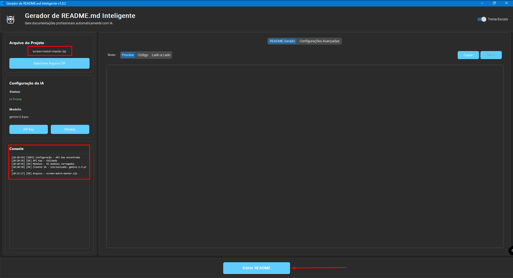
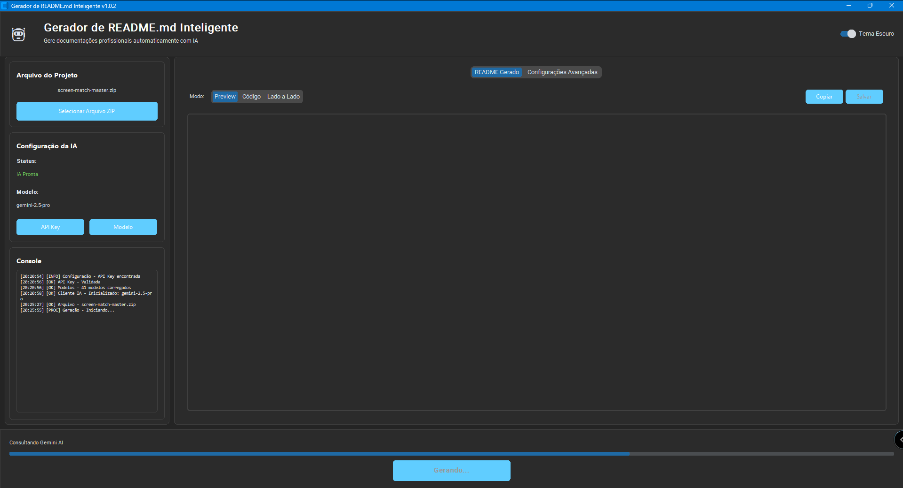
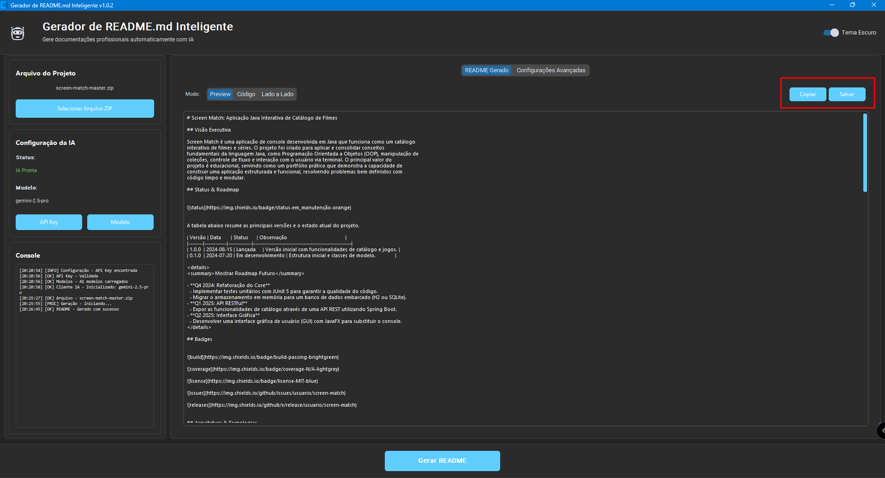
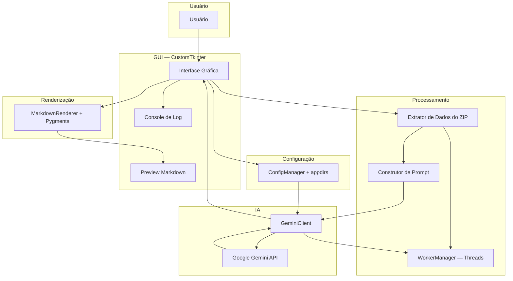

<div align="center">

# Gerador de README.md Inteligente

[](https://github.com/ESousa97/readme-generate/actions)
[](https://www.codefactor.io/repository/github/esousa97/readme-generate)
[](https://opensource.org/licenses/MIT)
[](#)

**Aplicação desktop em Python para geração automática de READMEs profissionais com IA — interface CustomTkinter com tema claro/escuro, análise inteligente de projetos a partir de arquivos ZIP, integração com Google Gemini API (flash/pro), 5 estilos de README (Profissional, Detalhado, Minimalista, Tutorial, Open Source), prompt personalizado, filtros configuráveis de arquivos, preview Markdown em tempo real, log de operações e exportação para `.md`.**

[Download v1.0.2 (.exe)](https://github.com/ESousa97/readme-generate/releases/download/v1.0.2/Readme-Generate.exe) · [Release Notes](https://github.com/ESousa97/readme-generate/releases/tag/v1.0.2)

</div>

---

> **⚠️ Projeto Arquivado**
> Este projeto não recebe mais atualizações ou correções. O código permanece disponível como referência e pode ser utilizado livremente sob a licença MIT. Fique à vontade para fazer fork caso deseje continuar o desenvolvimento.

---

## Índice

- [Sobre o Projeto](#sobre-o-projeto)
- [Prévia](#prévia)
- [Funcionalidades](#funcionalidades)
- [Tecnologias](#tecnologias)
- [Arquitetura](#arquitetura)
- [Estrutura do Projeto](#estrutura-do-projeto)
- [Começando](#começando)
  - [Pré-requisitos](#pré-requisitos)
  - [Instalação](#instalação)
  - [Configuração da API Key](#configuração-da-api-key)
  - [Uso](#uso)
- [Uso Avançado](#uso-avançado)
  - [Configurações Avançadas de Geração](#configurações-avançadas-de-geração)
  - [Fluxo Completo de Geração](#fluxo-completo-de-geração)
- [API Reference Interna](#api-reference-interna)
- [Bugs Conhecidos](#bugs-conhecidos)
- [FAQ](#faq)
- [Licença](#licença)
- [Contato](#contato)

---

## Sobre o Projeto

Aplicação desktop que automatiza a criação de documentação de projetos de software usando IA generativa. O usuário fornece um arquivo ZIP do projeto, a aplicação analisa a estrutura e o conteúdo dos arquivos, e o Google Gemini gera um README.md contextualizado e profissional.

O repositório prioriza:

- **Análise inteligente de projetos** — `extract_project_data_from_zip` percorre a estrutura do ZIP, extrai metadados e trechos de código relevantes, aplicando filtros configuráveis (tamanho máximo por arquivo, número máximo de arquivos, exclusão de testes/docs/config) para otimizar o volume de dados enviados à IA
- **Integração com Google Gemini** — `GeminiClient` gerencia autenticação, seleção de modelo (`gemini-1.5-flash` padrão ou `gemini-1.5-pro`), envio de prompts e tratamento de erros específicos da API (`QuotaExceededException`, `ConnectionError`, chave inválida)
- **Engenharia de prompt contextualizada** — `build_prompt` combina dados extraídos do projeto com estilo selecionado (Profissional, Detalhado, Minimalista, Tutorial, Open Source) e instruções personalizadas do usuário para gerar prompts otimizados
- **Interface moderna com CustomTkinter** — GUI com tema claro/escuro (auto-detect via `darkdetect`), painéis esquerdo (controles) e direito (preview), console de log em tempo real, barra de progresso e tooltips contextuais
- **Processamento assíncrono** — `WorkerManager` executa análise do ZIP e chamadas à API em threads separadas para manter a GUI responsiva durante operações demoradas
- **Persistência de configurações** — `ConfigManager` com `appdirs` armazena API Key, modelo preferencial e configurações avançadas em diretórios padrão do sistema operacional (Windows/macOS/Linux)
- **Distribuição como executável** — Empacotamento via PyInstaller para `.exe` standalone, eliminando necessidade de Python instalado para o usuário final

---

## Prévia

















---

## Funcionalidades

- **Geração de README com IA** — Análise contextual do projeto via Google Gemini, gerando documentação semanticamente rica com seções adaptadas ao conteúdo do código (arquitetura, funcionalidades, pré-requisitos, instalação, uso)
- **5 estilos de README** — Profissional (corporativo), Detalhado (técnico e abrangente), Minimalista (direto ao ponto), Tutorial (passo a passo), Open Source (foco em contribuição e licença)
- **Prompt personalizado** — Opção de adicionar instruções específicas para a IA (ex: "Inclua seção sobre considerações de segurança" ou "Descreva a arquitetura como microsserviços")
- **Filtros de arquivo configuráveis** — Inclusão/exclusão de testes, documentação existente e configs; limites de tamanho máximo por arquivo (KB) e número máximo de arquivos analisados
- **Opções de conteúdo** — Toggle para inclusão de badges de status, índice navegável (TOC) e exemplos de uso no README gerado
- **Análise de ZIP** — Extração inteligente de estrutura de diretórios, metadados e trechos iniciais de código de arquivos relevantes dentro do arquivo compactado
- **Preview Markdown** — Renderização em tempo real do README gerado via `markdown` + `pygments` (syntax highlighting) em painel HTML dentro da GUI
- **Console de log** — Feedback em tempo real sobre cada etapa: validação de chave, análise do ZIP, envio para IA, geração concluída, erros
- **Tema claro/escuro** — Auto-detect do tema do sistema via `darkdetect`, com toggle manual no menu
- **Seleção de modelo** — Configuração do modelo Gemini via menu (`gemini-1.5-flash` para velocidade, `gemini-1.5-pro` para maior capacidade)
- **Diretório de saída** — Seleção do destino do README gerado, persistido entre sessões
- **Portabilidade** — Funciona em Windows, macOS e Linux; distribuição como `.exe` via PyInstaller ou execução via código-fonte

---

## Tecnologias


### Dependências Detalhadas

| Categoria | Biblioteca | Versão | Função |
| --- | --- | --- | --- |
| **Interface** | customtkinter | ≥5.2.0 | GUI moderna com tema claro/escuro |
| | CTkMessagebox | ≥2.5 | Janelas de mensagem estilizadas |
| | CTkToolTip | ≥0.8 | Dicas contextuais em componentes |
| | CTkListbox | ≥1.5 | Lista customizada com estilo moderno |
| | Pillow | ≥9.0.0 | Manipulação de imagens e ícones |
| **IA** | google-generativeai | ≥0.3.0 | Cliente oficial da API Gemini |
| **Markdown** | markdown | ≥3.4.0 | Conversão Markdown → HTML para preview |
| | pygments | ≥2.12.0 | Syntax highlighting em blocos de código |
| **Sistema** | appdirs | ≥1.4.4 | Diretórios padrão de config por OS |
| | darkdetect | ≥0.7.0 | Detecção de tema do sistema (claro/escuro) |
| **Rede** | requests | ≥2.28.0 | Requisições HTTP auxiliares |
| **Tooltips** | tkinter-tooltip | ≥2.0.0 | Alternativa complementar para tooltips |

---

## Arquitetura



### Componentes e Responsabilidades

| Componente | Módulo | Responsabilidade |
| --- | --- | --- |
| **GUI** | `gui/app_gui.py` | Janela principal, painéis esquerdo/direito, barra de menu, barra de progresso |
| **Header** | `gui/ui_header.py` | Título, seleção de arquivo ZIP |
| **Left Panel** | `gui/ui_left_panel.py` | Controles de geração, botão "Gerar README" |
| **Right Panel** | `gui/ui_right_panel.py` | Abas de README gerado e preview HTML |
| **Settings Tab** | `gui/ui_settings_tab.py` | Configurações avançadas (filtros, estilo, prompt personalizado) |
| **Theme Manager** | `gui/theme_manager.py`, `gui/ctk_theme_manager.py` | Toggle claro/escuro + auto-detect |
| **Menus** | `gui/menus.py` | Menu Arquivo (API Key, modelo, diretório de saída) |
| **Worker** | `gui/worker.py`, `gui/worker_manager.py` | Execução assíncrona de tarefas (ZIP + IA) em threads |
| **Logic** | `gui/logic.py` | Extração de dados do ZIP, construção de prompt, limpeza de conteúdo |
| **Markdown Renderer** | `gui/markdown_renderer.py` | Conversão Markdown → HTML com syntax highlighting |
| **Preview** | `gui/preview_widget.py` | Widget de preview HTML renderizado |
| **Syntax Highlighter** | `gui/syntax_highlighter.py` | Realce de sintaxe via Pygments |
| **Widgets** | `gui/widgets.py`, `gui/ctk_widgets.py` | Componentes customizados (console, botões, etc.) |
| **GeminiClient** | `ia_client/gemini_client.py` | Autenticação, seleção de modelo, envio de prompt, tratamento de erros da API |
| **ConfigManager** | `config_manager.py` | Persistência de API Key, modelo, diretório de saída e configurações avançadas |
| **Constants** | `constants.py` | Constantes globais da aplicação |
| **Logger** | `logger_setup.py` | Configuração de logging (console + arquivo `app.log`) |
| **File Helper** | `utils/file_helper.py` | Utilitários de manipulação de arquivos |

### Fluxo de Dados

1. O usuário seleciona um arquivo ZIP via GUI
2. `WorkerManager` inicia thread de análise → `extract_project_data_from_zip` percorre o ZIP, aplica filtros e extrai trechos de código
3. `build_prompt` combina dados extraídos + estilo selecionado + prompt personalizado
4. `WorkerManager` inicia thread de IA → `GeminiClient` envia prompt para Google Gemini API
5. Resposta Markdown retorna ao `GeminiClient` → exibida na aba "README Gerado"
6. `MarkdownRenderer` converte para HTML → exibido no preview
7. Console de log mostra cada etapa em tempo real
8. Usuário pode salvar como `.md` ou copiar como Markdown

---

## Estrutura do Projeto

```
readme-generate/
├── run_app.py                              # Entry point da aplicação
├── requirements.txt                        # Dependências Python
├── gerador_readme_ia/
│   ├── __init__.py
│   ├── config_manager.py                   # Persistência de configs (appdirs)
│   ├── constants.py                        # Constantes globais
│   ├── logger_setup.py                     # Configuração de logging
│   ├── gui/
│   │   ├── __init__.py
│   │   ├── app_gui.py                      # Janela principal (CustomTkinter)
│   │   ├── logic.py                        # Extração de ZIP + build de prompt
│   │   ├── menus.py                        # Menu Arquivo (API Key, modelo, diretório)
│   │   ├── ui_header.py                    # Painel de título e seleção de ZIP
│   │   ├── ui_left_panel.py                # Painel esquerdo (controles)
│   │   ├── ui_right_panel.py               # Painel direito (README + preview)
│   │   ├── ui_controls.py                  # Botões e controles de ação
│   │   ├── ui_settings_tab.py              # Configurações avançadas
│   │   ├── markdown_renderer.py            # Markdown → HTML
│   │   ├── preview_widget.py               # Widget de preview HTML
│   │   ├── syntax_highlighter.py           # Pygments syntax highlighting
│   │   ├── theme.py                        # Definições de tema
│   │   ├── theme_manager.py                # Toggle claro/escuro
│   │   ├── ctk_theme_manager.py            # Integração CustomTkinter + tema
│   │   ├── widgets.py                      # Widgets customizados
│   │   ├── ctk_widgets.py                  # Widgets CTk específicos
│   │   ├── worker.py                       # Worker thread individual
│   │   └── worker_manager.py               # Orquestrador de threads assíncronas
│   ├── ia_client/
│   │   ├── __init__.py
│   │   └── gemini_client.py                # Cliente Google Gemini API
│   └── utils/
│       ├── __init__.py
│       └── file_helper.py                  # Utilitários de arquivo
├── imgs/
│   ├── Screenshot_1.png                    # Tela inicial
│   ├── Screenshot_2.png                    # Inserção de API Key
│   ├── Screenshot_3.png                    # Seleção de modelo
│   ├── Screenshot_4.png                    # Modelos disponíveis
│   ├── Screenshot_5.png                    # Configurações avançadas
│   ├── Screenshot_6.png                    # Seleção de ZIP
│   ├── Screenshot_7.png                    # ZIP selecionado + console
│   ├── Screenshot_8.png                    # Geração em andamento
│   └── Screenshot_9.png                    # README gerado
├── LICENSE                                 # MIT
└── README.md
```

---

## Começando

### Pré-requisitos

- **Python 3.8+** (recomendado 3.10+) — [Download](https://www.python.org/downloads/)
- **pip** — Incluso a partir do Python 3.4+
- **API Key do Google Gemini** — [Obter no Google AI Studio](https://aistudio.google.com/app/apikey)
- **Conexão com a internet** — Necessária para comunicação com a API Gemini

> **Alternativa:** Baixe o [executável .exe](https://github.com/ESousa97/readme-generate/releases/download/v1.0.2/Readme-Generate.exe) para Windows (não requer Python instalado).

### Instalação

```bash
# Clonar o repositório
git clone https://github.com/ESousa97/readme-generate.git
cd readme-generate

# Criar e ativar ambiente virtual (recomendado)
python -m venv .venv

# Windows
.venv\Scripts\activate

# macOS/Linux
source .venv/bin/activate

# Instalar dependências
pip install -r requirements.txt
```

### Configuração da API Key

1. Gere sua chave em [Google AI Studio](https://aistudio.google.com/app/apikey)
2. Na aplicação: `Arquivo` → `Configurar API Key...`
3. Cole a chave e confirme
4. O status de validação aparece na barra inferior

> A chave é armazenada localmente via `appdirs` em `settings_readme_generator.ini`, no diretório de configuração padrão do seu OS. Nunca é enviada a servidores externos além da API do Google.

### Uso

```bash
python run_app.py
```

Ou via executável: baixe [Readme-Generate.exe](https://github.com/ESousa97/readme-generate/releases/download/v1.0.2/Readme-Generate.exe) e execute diretamente.

---

## Uso Avançado

### Configurações Avançadas de Geração

Acessíveis pela aba "Configurações Avançadas" na interface:

**Estilo do README:**

| Estilo | Descrição |
| --- | --- |
| Profissional | Enfoque executivo e corporativo |
| Detalhado | Completo, técnico e abrangente |
| Minimalista | Direto ao ponto: o que é, como instalar e usar |
| Tutorial | Estrutura passo a passo |
| Open Source | Estrutura amigável para contribuidores |

**Filtros de Arquivo:**

- **Incluir arquivos de teste** — Habilita análise de `tests/`, `test_*.py`, etc.
- **Incluir documentação existente** — Considera `docs/`, `README.md`, etc.
- **Incluir arquivos de configuração** — Usa `.env`, `pyproject.toml`, `config.json`, `package.json`
- **Tamanho máximo por arquivo (KB)** — Limita leitura para evitar arquivos grandes (`.log`, `.db`)
- **Máximo de arquivos** — Controla o total de arquivos na análise

**Prompt Personalizado:**

Habilite "Usar prompt personalizado" e escreva instruções específicas. Exemplo:

> *"Descreva a arquitetura como microsserviços e inclua uma chamada cURL da API REST."*

**Opções de Conteúdo:**

- Incluir badges de status
- Incluir índice navegável (TOC)
- Incluir exemplos de uso

### Fluxo Completo de Geração

1. **Compacte seu projeto** em um arquivo `.zip`
2. **Selecione o ZIP** via botão "Selecionar Arquivo ZIP do Projeto"
3. **Configure opções avançadas** (estilo, filtros, prompt personalizado)
4. **Clique em "Gerar README"** — acompanhe no console de log
5. **Visualize o resultado** na aba "README Gerado" e no preview HTML
6. **Exporte** — salve como `.md` ou copie o Markdown

**Exemplo de configuração para projeto acadêmico:**

- Estilo: `Detalhado`
- Prompt: *"Inclua seção sobre metodologia de pesquisa e validação experimental"*
- Tamanho máximo por arquivo: `20KB`
- Máximo de arquivos: `50`
- Badges, TOC e exemplos: ativados

---

## API Reference Interna

A aplicação não expõe API pública — é um software desktop standalone. A comunicação com o Google Gemini é encapsulada em `gemini_client.py`:

```python
# Trecho simplificado de gerador_readme_ia/ia_client/gemini_client.py
import google.generativeai as genai

class GeminiClient:
    def __init__(self, api_key: str, model_name: str):
        genai.configure(api_key=api_key)
        self.model = genai.GenerativeModel(model_name=f'models/{model_name}')

    def send_conversational_prompt(self, prompt_text: str) -> str:
        generation_config = genai.types.GenerationConfig(
            temperature=0.5,
            max_output_tokens=8192,
            top_p=0.8,
            top_k=40
        )
        response = self.model.generate_content(
            contents=prompt_text,
            generation_config=generation_config
        )
        return response.text
```

**Parâmetros de geração:** temperature=0.5, max_output_tokens=8192, top_p=0.8, top_k=40.

**Documentação da API Gemini:** [Google AI Studio](https://aistudio.google.com/app/apikey) · [Docs](https://ai.google.dev/docs) · [Pricing](https://ai.google.dev/pricing)

---

## Bugs Conhecidos

**Botão "Salvar" inoperante** — O botão "Salvar" no painel direito não grava o conteúdo. Solução temporária: use "Copiar Markdown" e cole em um editor externo (VS Code, etc.). Status: em investigação.

> Para reportar novos bugs: [Issues](https://github.com/ESousa97/readme-generate/issues)

---

## FAQ

<details>
<summary><strong>Preciso de API Key para usar a aplicação?</strong></summary>

Sim. A geração de README usa a API do Google Gemini, que requer autenticação. Obtenha uma chave gratuitamente (com limites de uso) no [Google AI Studio](https://aistudio.google.com/app/apikey). A chave é armazenada apenas localmente via `appdirs`.
</details>

<details>
<summary><strong>A aplicação funciona offline?</strong></summary>

Parcialmente. A interface e a análise do ZIP funcionam offline, mas a geração do README requer conexão com a internet para comunicação com a API Gemini.
</details>

<details>
<summary><strong>Quais modelos Gemini posso usar?</strong></summary>

Por padrão, `gemini-1.5-flash` (otimizado para velocidade e custo). Você pode configurar `gemini-1.5-pro` (maior capacidade) via `Arquivo` → `Selecionar Modelo Gemini...`. Apenas modelos disponíveis na sua conta Google AI Studio serão aceitos.
</details>

<details>
<summary><strong>O que fazer se o README gerado estiver incompleto ou incorreto?</strong></summary>

A IA gera um rascunho baseado nos dados extraídos. Para melhorar os resultados: ajuste os filtros de arquivo para incluir/excluir mais informações, use prompt personalizado com instruções mais específicas, selecione um modelo com maior capacidade (`gemini-1.5-pro`), ou edite o resultado manualmente. O console de log pode indicar erros ou limitações durante o processamento.
</details>

---

## Licença

Este projeto está sob a licença MIT. Veja o arquivo [LICENSE](LICENSE) para mais detalhes.

```
MIT License - você pode usar, copiar, modificar e distribuir este código.
```

---

## Contato

**José Enoque Costa de Sousa**

[](https://www.linkedin.com/in/enoque-sousa-bb89aa168/)
[](https://github.com/ESousa97)
[](https://enoquesousa.vercel.app)

---

<div align="center">

**[⬆ Voltar ao topo](#gerador-de-readmemd-inteligente)**

Feito com ❤️ por [José Enoque](https://github.com/ESousa97)

**Status do Projeto:** Archived — Sem novas atualizações

</div>
